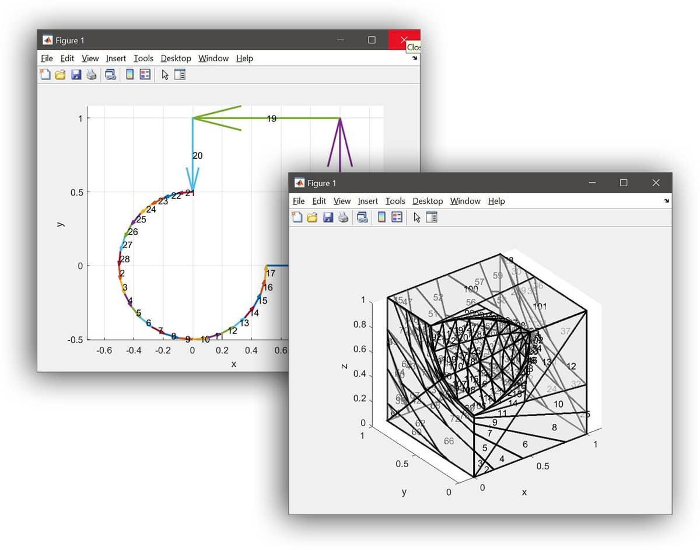

GEOMLib - 3D CSG Geometry Library for MATLAB® and GNU Octave
============================================================

**GEOMLib** is a 2D and 3D geometry library for MATLAB® and GNU Octave
allowing _mesh based_ CSG (Composite Solid Geometry) operations.

Originally developed for use with the [FEATool Multiphysics](https://www.featool.com)
FEA simulation toolbox, but now replaced with the OpenCASCADE geometry
kernel to support BREP CAD geometry support.

Installation
------------

Download and copy the library to a folder. Start MATLAB® or Octave and
start the `runtests` script (or `runtests 1` for verbose output) to
run the test and validation suite.

Examples
--------

1. 2D example of the union of a circle and unit square

        % Create circle
        c1 = gobj_circle([0, 0], 0.5, 'C1');
        c1 = convert_gobj_polygons( c1, 1 );
        c1 = csg_op( c1, 'b' );

        % Create unit square
        r1 = gobj_rectangle(0, 1, 0, 1, 'R1');
        r1 = convert_gobj_polygons( r1, 2 );
        r1 = csg_op( r1, 'b' );

        % Join circle and square
        [res,~,stat] = csg_op( c1, r1, '+' );

        % Visualize result
        csg_op(res, 'v')

2. 3D subtraction of a sphere from a unit cube

        % Create sphere
        s1 = gobj_sphere([0, 0, 1], 0.5, 'S1');
        s1 = convert_gobj_polygons( s1, 1 );
        s1 = csg_op( s1, 'b' );

        % Create unit cube
        b1 = gobj_block(0, 1, 0, 1, 0, 1, 'B1');
        b1 = convert_gobj_polygons( b1, 2 );
        b1 = csg_op( b1, 'b' );

        % Subtracting sphere from cube
        [res,~,stat] = csg_op( b1, s1, '-' );

        % Visualize result
        csg_op(res, 'v')

3. For more examples see the tests in the _test_ directory.

Functions
---------

    % Main CSG functions:

    csg_op - apply CSG operation on polygons
    csg_polygon_recombination - recombine and tessellate polygons
    csg_polygon_tesselation - recombine and tessellate polygons

    % Geometry object primitives:

    gobj_block - create block
    gobj_circle - create circle
    gobj_cylinder - create cylinder
    gobj_ellipse - create ellipse
    gobj_polygon - create polygon
    gobj_rectangle - create rectangle
    gobj_sphere - create sphere

    % Geometry utility and help functions:

    convert_gobj_polygons - extract polygons from geometry object
    deduplicate - remove duplicate rows or columns within tolerance
    uunique - unsorted set unique

Support
-------

This library has been open sourced on an _as is_ basis under the
AGPLv3 License (see included LICENSE file) without warranty or
support.

For technical support, consulting, and custom development of this
library, commercial licensing, or use of the newer OpenCASCADE based
geometry library (allowing BREP CAD geometry modeling such as STEP and
IGES formats) please [contact Precise
Simulation](https://www.precisesimulation.com#contact) directly.

License
-------

Copyright (C) 2013-2022 Precise Simulation Ltd.

Keywords: Geometry, CSG, Mesh, MATLAB®, Octave

This program is free software; you can redistribute it and/or modify
it under the terms of version 3 of the GNU Affero General Public
License (AGPLv3) as published by the Free Software Foundation.

This program is distributed in the hope that it will be useful, but
WITHOUT ANY WARRANTY; without even the implied warranty of
MERCHANTABILITY or FITNESS FOR A PARTICULAR PURPOSE. See the GNU
General Public License for more details.

You should have received a copy of the GNU Affero General Public
License along with this program. If not, see
[http://www.gnu.org/licenses](http://www.gnu.org/licenses).

Trademarks
----------

FEATool Multiphysics™ is a trademark of Precise Simulation
Limited. MATLAB® is a registered trademark of The MathWorks, Inc. All
other trademarks are the property of their respective owners. Precise
Simulation and its products are not affiliated with, endorsed, or
sponsored by these trademark owners.
